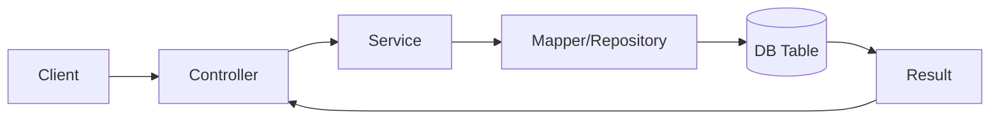
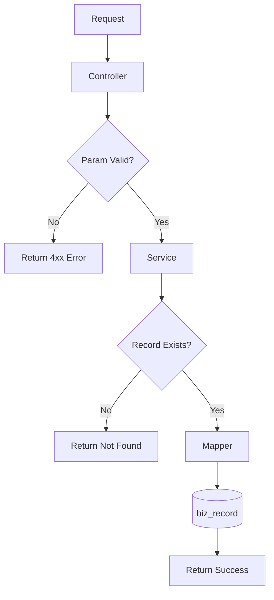
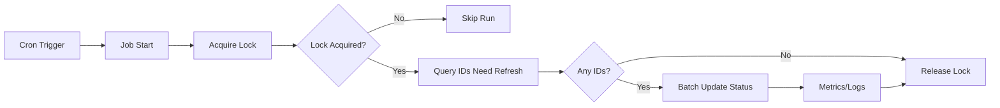
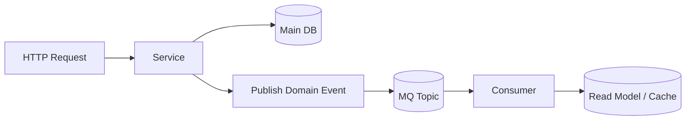
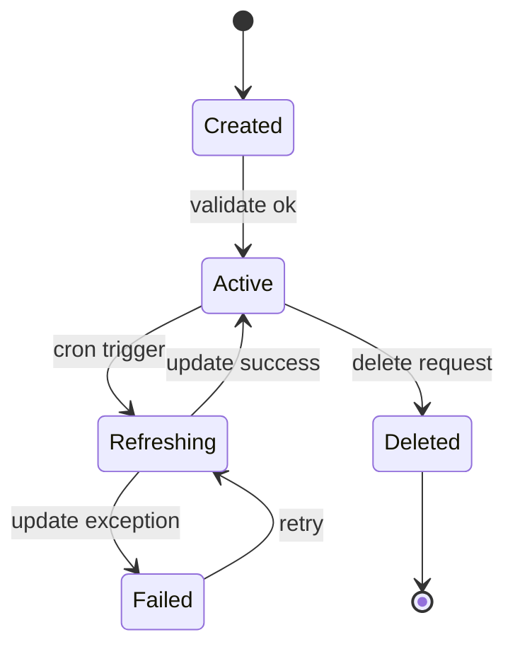
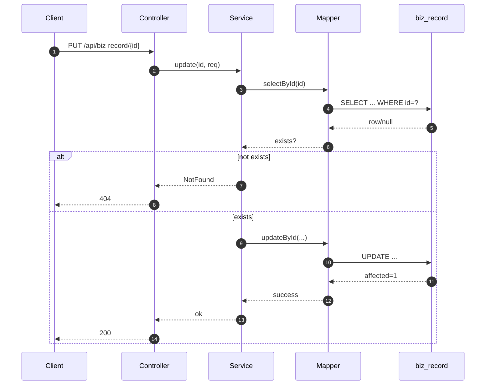
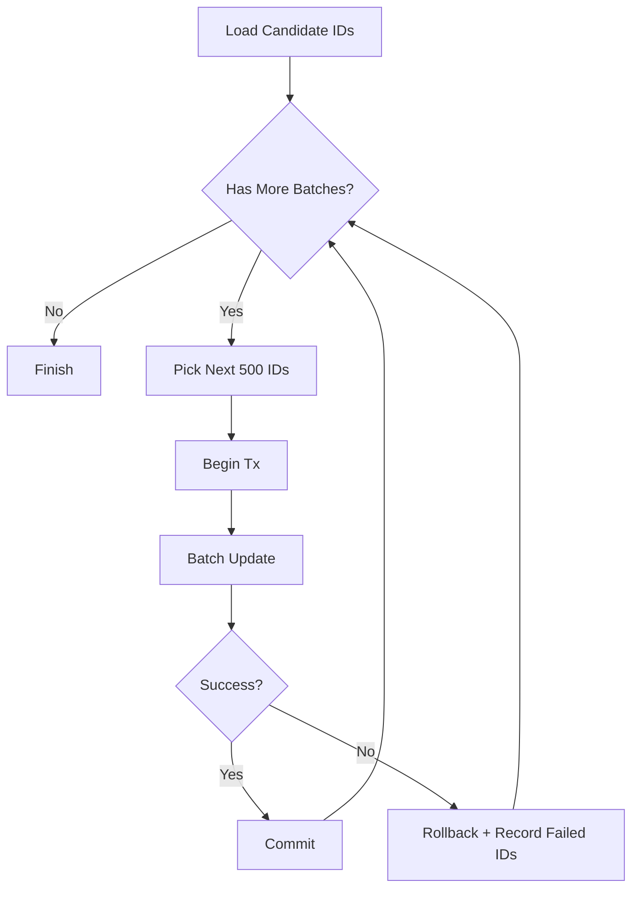
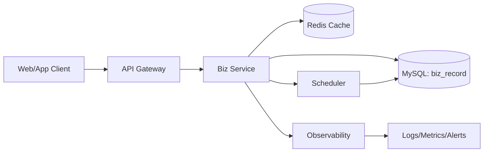

# Mermaid Template Library

Use these templates as presets. Keep node IDs stable and do append-only updates for minimal visual diff.

## T1: CRUD Service Flow (flowchart)

Best for:
- Standard CRUD chains
- Controller-Service-DAO layered architecture

## T2: CRUD + Validation + Error Path (flowchart)

Best for:
- Update/Delete with existence check
- API behavior documentation

## T3: Scheduled Batch Update (flowchart)

Best for:
- Scheduled tasks
- Retry/lock/idempotency discussion

## T4: Service + Async Event (flowchart)

Best for:
- Event-driven architecture
- Write path and async side effects

## T5: Status Transition (stateDiagram-v2)

Best for:
- Lifecycle/status fields
- Workflow transitions and retry paths

## T6: API Sequence (sequenceDiagram)

Best for:
- API interaction details
- Success/failure branching at runtime

## T7: Batch Loop Detail (flowchart)

Best for:
- Batch update behavior
- Tx boundary and error handling

## T8: Architecture Context (flowchart)

Best for:
- High-level architecture section
- Context + dependencies in one view

## Minimal-Change Rules

1. Keep ID namespace stable: `N1`, `N2`, `N3`...
2. Add new nodes as `N10+`; never renumber existing IDs.
3. Keep layout direction fixed (`LR` or `TB`) unless unreadable.
4. Prefer text edits on existing nodes over topology rewrites.
5. When deleting behavior, mark as deprecated first, then remove in later revision if needed.
